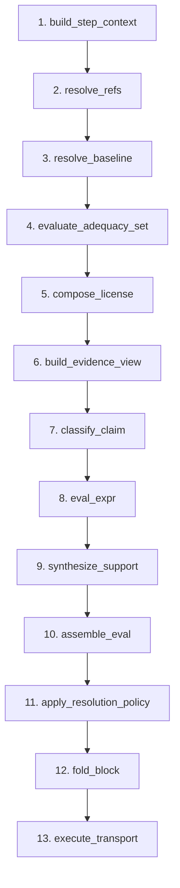
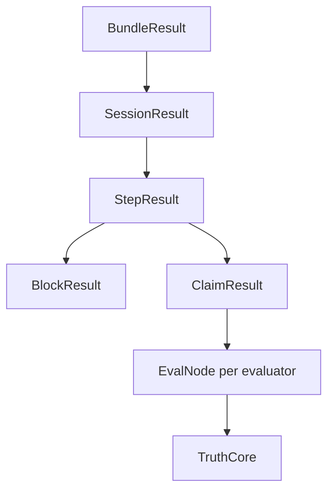

# How Evaluation Works

## Overview

Evaluation is the core operation: evaluators assess each claim in a bundle and produce truth values. The engine executes a fixed 13-phase pipeline per step. See [ADR-002](adr/002-execution-model.md) for design rationale.

## The 13-Phase Pipeline

| Phase | Primitive | What it does |
|-------|-----------|--------------|
| 1 | `build_step_context` | Assemble step context from bundle, session, and step config |
| 2 | `resolve_refs` | Resolve evaluator bindings, evidence refs, and policies |
| 3 | `resolve_baseline` | Initialize or retrieve baseline state |
| 4 | `evaluate_adequacy_set` | Score adequacy assessments; gate downstream evaluation |
| 5 | `compose_license` | Compute per-claim license results from adequacy |
| 6 | `build_evidence_view` | Build per-claim evidence views |
| 7 | `classify_claim` | Classify claims by stratum and expression type |
| 8 | `eval_expr` | Evaluate claim expressions per evaluator, producing `TruthCore` |
| 9 | `synthesize_support` | Synthesize support from evidence and evaluator results |
| 10 | `assemble_eval` | Assemble per-evaluator `EvalNode` results |
| 11 | `apply_resolution_policy` | Aggregate evaluator results into resolved truth |
| 12 | `fold_block` | Fold claim results into block-level summaries |
| 13 | `execute_transport` | Execute cross-frame transport via bridges |

## Result Hierarchy

- **BundleResult** -- top-level container with sessions and diagnostics
- **SessionResult** -- one per evaluation session
- **StepResult** -- contains block and claim results
- **ClaimResult** -- per-claim with an `EvalNode` from each evaluator
- **EvalNode** -- single evaluator's assessment containing a `TruthCore`

## Key Concepts

**TruthValue** -- four-valued logic:

| Value | Meaning |
|-------|---------|
| `T` | True -- the claim holds |
| `F` | False -- the claim does not hold |
| `B` | Both -- contradictory evidence (paraconsistent) |
| `N` | Neither -- insufficient evidence |

**Resolution policies** aggregate multi-evaluator results: `single` (one evaluator), `unanimous` (all must agree), `majority`, or `adjudicated` (delegate to binding).

**Block folding** (Phase 12) derives block-level truth from constituent claim results.

Each phase primitive can be replaced via `PrimitiveSet`. See the [Plugin SDK Overview](plugin_sdk_overview.md).
